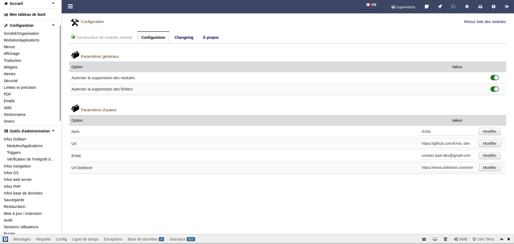

# DAMB

**D**olibarr **A**dvanced **M**odule **B**uilder ou DAMB pour faire plus court est un générateur de module libre et gratuit disposant d'une interface utilisateur simple et intuitive. Ce dernier vous facilitera considérablement la tâche pour créer vos futurs modules.

## Créer un module

Pour créer un nouveau module vous avez tout d'abord besoin d'un squelette de module. Ce squelette est un ensemble de fichiers et de dossiers bien structurés qui font la base du module, c'est ce qui permet d'ailleurs à Dolibarr de reconnaître que c'est un module et non pas juste un dossier contenant des fichiers quelconques.

La structure ou bien le squelette d'un module ressemble à ceci:

- Le dossier **admin** contient toutes les pages qui seront consultées par un administrateur Dolibarr (la page de configuration, la page d'informations sur le module, etc..).
- Le dossier **class** contiendra les classes de vos objets (c'est de la POO: **P**rogrammation **O**rienté **O**bjet), et c'est la que vous aurez la pluspart du temps à écrire vos requêtes SQL et vos fonctions métiers.
- Le fichier **core/modules/modMyModule.class.php** est la classe principale du module, elle contient toutes les informations à propos du module (à titre d'exemple: le nom du module, sa version, les menus, les permissions etc..).
- Les dossiers **css**, **img** et **js** devraient contenir vos fichiers CSS, vos images et vos fichiers javascript.
- Le dossier **langs** contient les fichiers de traductions du module.
- Le dossier **lib** peut contenir vos bibliothèques PHP et/ou tout code externe que vous comptez utiliser dans votre module.
- Le dossier **sql** contient les fichiers SQL, c'est ce qui permet d'ajouter de nouvelles tables dans la base de données ou bien d'effectuer des modifications sur la bdd (**b**ase **d**e **d**onnées).
- Finalement, le dossier **tpl** n'est pas obligatoire, mais c'est là que sont rangés les templates utilisés dans les pages du module.

?> La structure démontrée en haut est un standard de Dolibarr, vous pourriez toujours changer certains aspects de cette structure mais il est toujours conseillé de suivre et rester dans le standard.

### Générer le squelette du module

Pour générer un squelette vide de module, soit vous le faites par vous même (en créant les dossiers et fichiers à la main) ou bien vous pouvez utiliser un générateur de module. C'est d'ailleurs içi que [damb](https://www.dolistore.com/fr/modules/1121-Constructeur-de-modules-avanc--.html) entre en jeu, il suffit de l'installer tout comme n'importe quel module et de l'activer, puis d'aller sur la page de création de module (voir les images en dessous).

!> Ce module ne peut être consulté ou utilisé que par un utilisateur disposant de privilèges d'administrateur.

Pour créer votre tout premier module, il faut saisir un nom et une image (voir la capture d'écran ci-dessous).

!> Veuillez faire attention à ne pas utiliser d'espace ou de caractère spécial dans le nom car ça peut vous causer des problèmes par la suite.

?> Les autres options sont facultatives, mais vous pouvez toujours vous amuser à les tester afin de mieux comprendre les possibilités que _damb_ vous offre.

Une fois la création validée, damb s'occupera de créer le squelette du module pour vous et mettra tout les fichiers et dossiers du module dans le répertoire **htdocs/custom** de Dolibarr. Il vous redirigera ensuite sur la page d'édition de votre module.

Vous pouvez maintenant:
- activer ou désactiver le module directement depuis la page d'édition.
- ajouter/modifier ou supprimer un fichier ou un dossier sur votre module.
- ajouter des widgets au module.
- créer des packages quand vous aurez fini le travail sur votre module.

!> Il n'est pas du tout nécéssaire d'utiliser la page d'édition de damb pour modifier votre module, si vous pensez pouvoir vous débrouiller par vous même vous pouvez toujours utiliser votre éditeur de texte favori.

**Notez-bien** que le module apparaît désormais sur la liste des modules de Dolibarr aussi.

?> **À savoir**: Il existe un module officiel de Dolibarr nommé **Module Builder** qui permet de faire pratiquement la même chose que damb (voir plus), toute fois ce dernier est encore experimental et peut être assez complexe à exploiter.

### Ajouter une page au module

Pour ajouter une nouvelle page PHP au module, vous cliquez sur le boutton nouvelle page (depuis la page d'édition) et vous entrez le nom de la page.

Pour consulter la page que vous venez de créer, il suffit de cliquer sur le boutton **Aperçu** à droite du nom de la page.

Il ne vous reste plus qu'à modifier le code source de la page et écrire votre propre code PHP dedans.

?> **Remarque**: damb ne pourra pas faire tout pour vous, il est juste là pour vous aider à bien démarrer, de ce fait il vous sera toujours nécessaire de plonger dans l'écosystème Dolibarr et de comprendre le fonctionnement des modules de base afin de mieux vous familiariser avec.

## Supprimer un module

Pour supprimer un module, pensez tout d'abord à le désactiver, puis supprimez le dossier du module à partir du dossier **htdocs/custom** de Dolibarr.

Une autre façon de faire serait d'utiliser damb pour le supprimer, pour ce faire, cliquez sur l'onglet **Modifier**.

Vous verrez une liste de tout les modules externes disponibles dans le dossier htdocs/custom. Supprimez ensuite le module que vous voulez en utilisant l'icône supprimer à droite de chaque module.

?> Si vous ne voyez pas d'icône supprimer à coté du nom des modules, veuillez autoriser la suppression des modules depuis la page de configuration du module damb.

## Configuration

Comme tout module, damb dispose d'une page de configuration où vous pouvez définir les différentes options de configuration de ce dernier.

