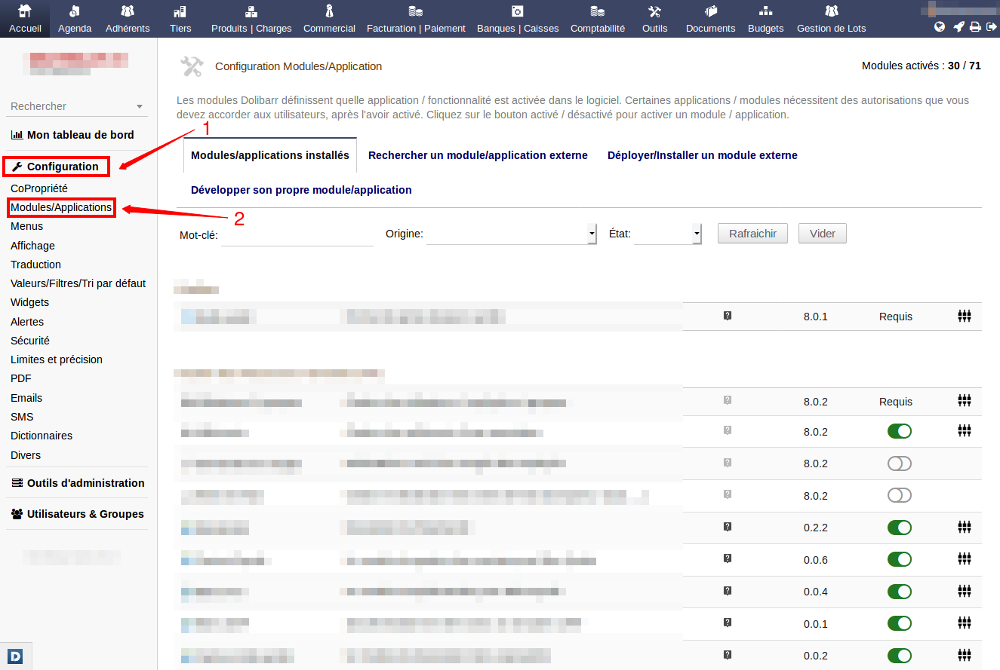
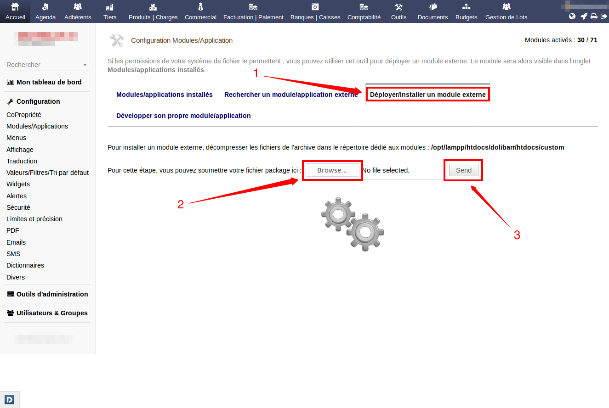
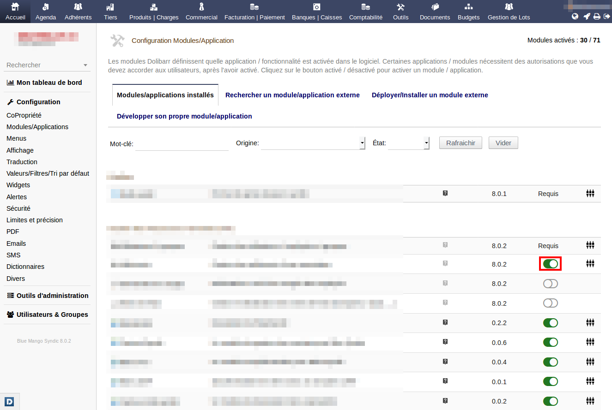
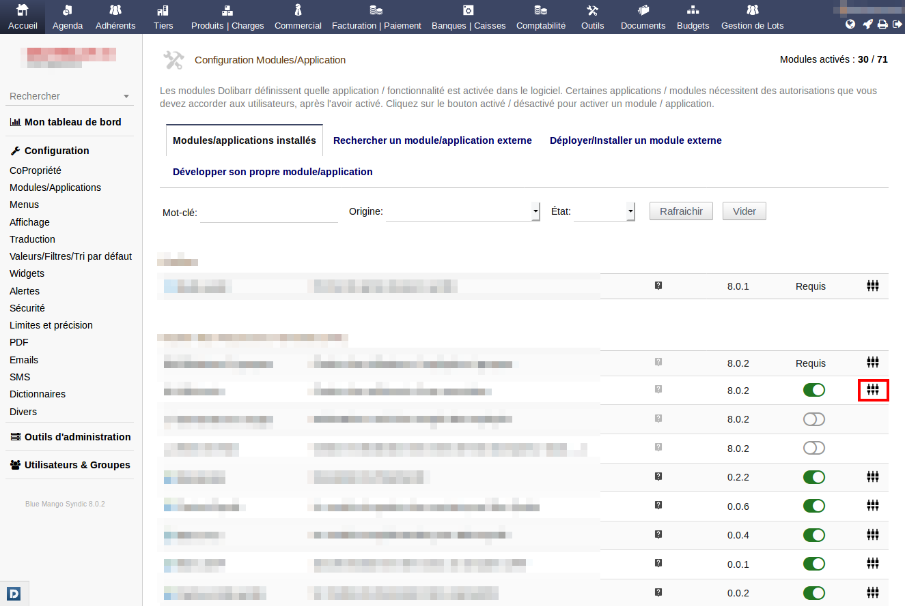

# Dolibarr

[Dolibarr ERP & CRM](https://www.dolibarr.fr/) est un logiciel modulaire (on n'active que les fonctions que l'on désire) de gestions de TPE/PME, d'indépendants, d'entrepreneurs ou d'associations. C'est un projet OpenSource qui s'exécute au sein d'un serveur Web (Apache, MySQL, PHP) et peut donc être accessible depuis n'importe quel lieu disposant d'une connexion Internet.

## Modules

Dolibarr dispose d'une large variété de modules permettant d'étendre et d'élargir ses fonctionnalités. Pour accéder à la liste des modules, il suffit de vous connecter sur Dolibarr puis d'aller sur le menu **Configuration** > **Modules/Applications**.

### Installer un module

Il existe 2 manières principales pour installer un module.

- La première étant de l'installer directement à l'aide d'un package (un package est tout simplement un archive **.zip** contenant tout les fichiers du module).

- La 2ème manière est de déposer le dossier du module (contenant tout ses fichiers) dans la racine de Dolibarr (**htdocs**) ou bien dans le dossier custom (**htdocs/custom**).

### Activer/désactiver un module

Pour activer ou bien désactiver un module sur Dolibarr rien de plus simple, il suffit d'actionner l'interrupteur qui se trouve à droite de chaque module.

### Configurer un module

La pluspart des modules ont des paramètres de configuration permettant de changer leur comportement. Vous trouverez un lien à coté de chaque module activé qui vous redirigera vers la page de configuration de ce dernier.

## Documentation

La documentation officielle de Dolibarr peut être consulté à partir du lien suivant: [www.dolibarr.fr/documentation](https://www.dolibarr.fr/documentation).
