# DAMB

**D**olibarr **A**dvanced **M**odule **B**uilder or simply DAMB is a free and opensource module generator with a simple and intuitive user interface. It will make your life much easier when it comes to create a new module.

## Create a module

To create a new module you first need a skeleton. This skeleton is a set of structured files and folders that form the basis of the module, which allows Dolibarr to recognize that it is a module and not just a folder containing some files.

The structure or the skeleton of a module looks like this:

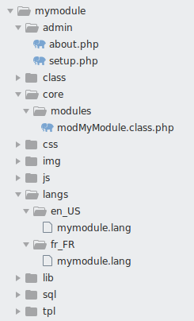

- The **admin** folder contains all the pages that will be consulted by a Dolibarr administrator (the configuration page, the module information page, etc...).
- The **class** folder will contain the classes of your objects (it's OOP: **O**bject-**O**riented **P**rogramming), and that's where you'll write most of the time your SQL queries and your business logic.
- The file **core/modules/modMyModule.class.php** is the main class of the module, it contains all the information about the module (for example: the name of the module, its version, the menus, permissions etc...).
- The **css**, **img** and **js** folders should contain your CSS files, images and javascript files.
- The **langs** folder contains the translation files of the module.
- The **lib** folder may contain your PHP libraries and/or any external code that you intend to use in your module.
- The **sql** folder contains the SQL files, which allows you to add new tables to the database or to make changes.
- Finally, the **tpl** folder is optional and can be used to store your templates (which might be used in your module pages).

?> The structure shown above is a Dolibarr standard, you could always change some aspects of this structure but it is always preferable to follow and stay in the standard.

### Generate the skeleton of the module

To generate an empty module skeleton, you can either do it yourself (by creating folders and files by hand) or you can use a module generator like [damb](https://www.dolistore.com/en/modules/1121-Advanced-Module-Builder.html), so just install it like any module and activate it, then go to the module creation page (see the images below).

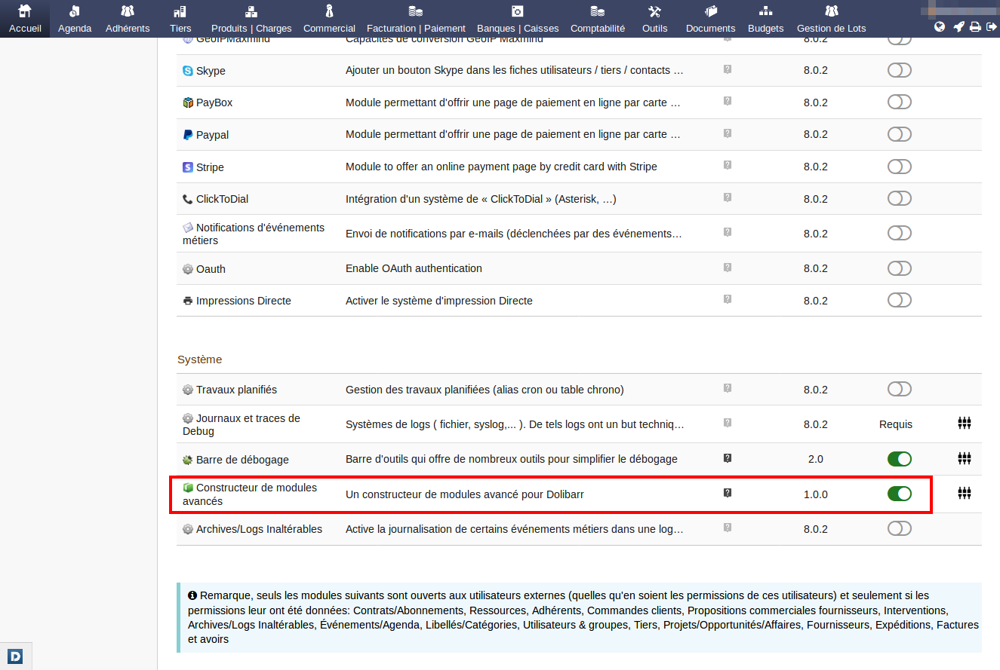

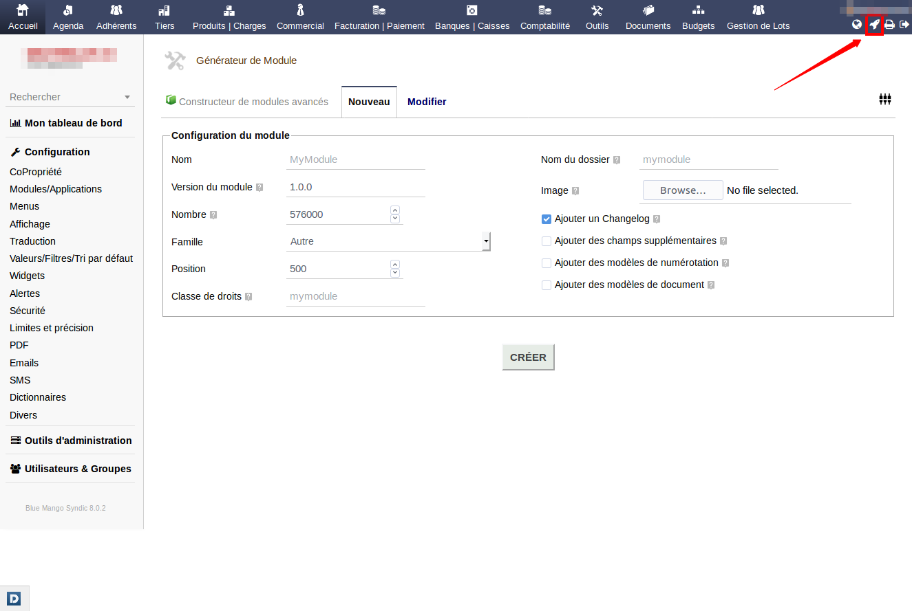

To create your first module, you must enter a name and choose an image (see the screenshot below).

!> Please be careful: do not use spaces or special characters in the name as this may cause you problems later.

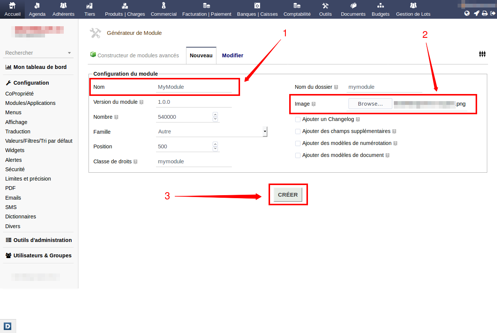

?> The other options are optional, but you can still have fun testing them to better understand the possibilities offered by _damb_.

Once the creation validated, damb will create the skeleton of the module for you and put all the files and folders of the module in the **htdocs/custom** directory of Dolibarr. It will then redirect you to the edit page of your module.

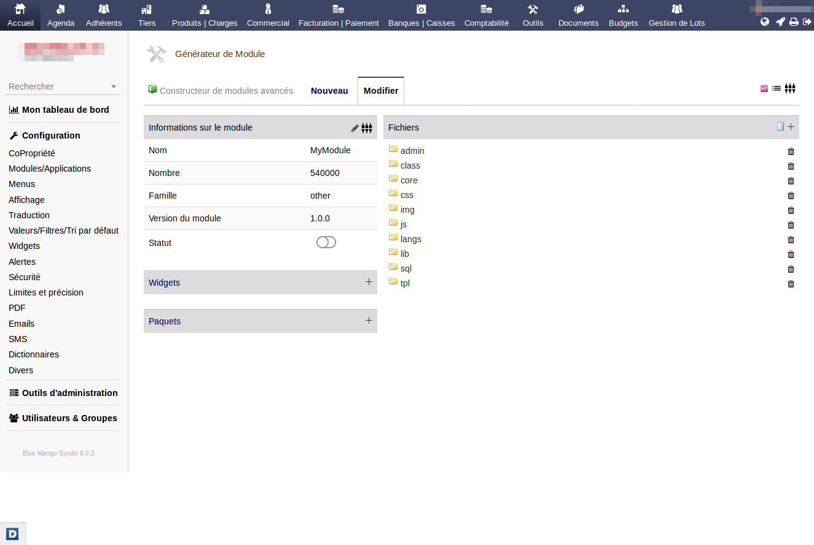

You can now:
- enable or disable the module directly from the edit page.
- add / edit or delete a file or folder in your module.
- add widgets to the module.
- create packages when you finish working on your module.

!> It is not necessary at all to use the damb editing page to modify your module, if you think you can handle things by yourself you can always use your favorite text editor.

**Please note** that the module now appears on Dolibarr's module list as well.

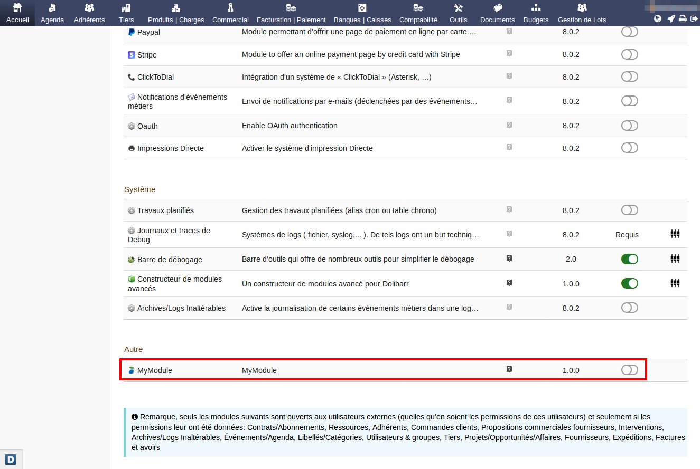

?> **To know**: There is an official Dolibarr module named **Module Builder** that allows you to do almost the same thing as damb (and even more), but it remains experimental and can be quite complex to use, in addition that it comes with a lot of unclean & boilerplate code.

### Add a page to the module

To add a new PHP page to the module, you click on the new page button (from the edit page) and you enter the name of the page.

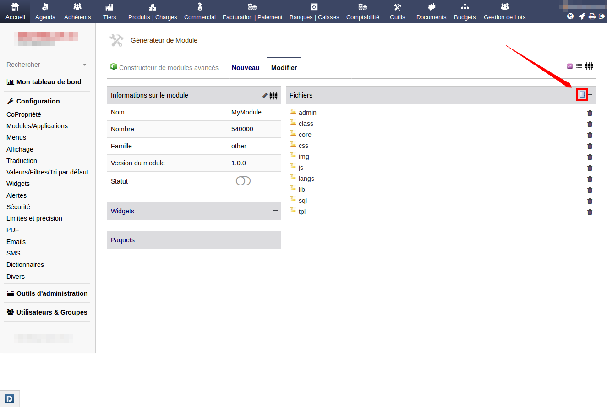

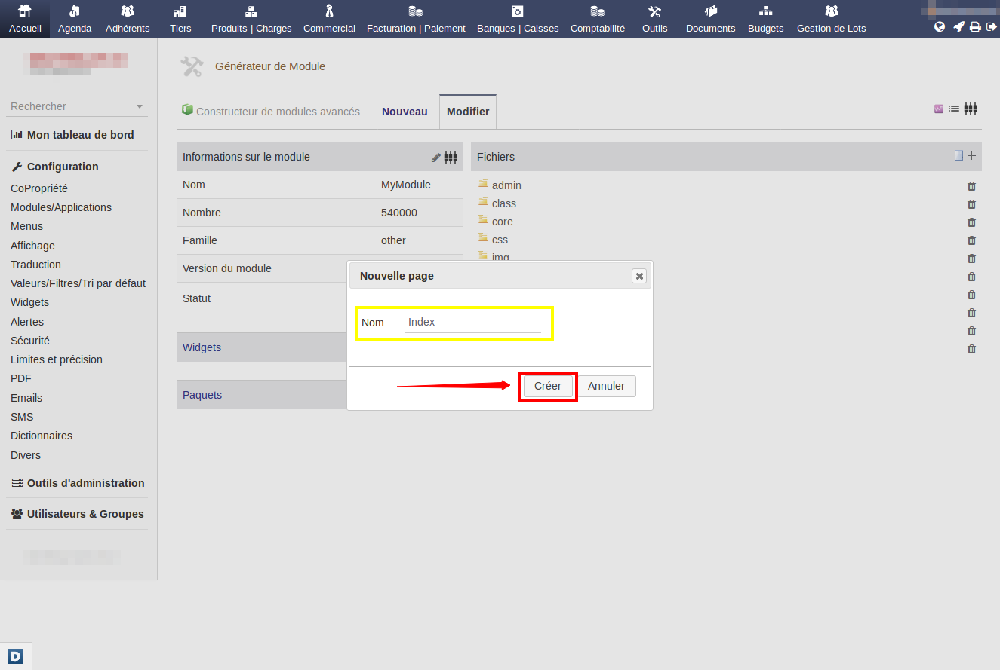

To view the page you just created, just click on the **Preview** button on the right of the page name.

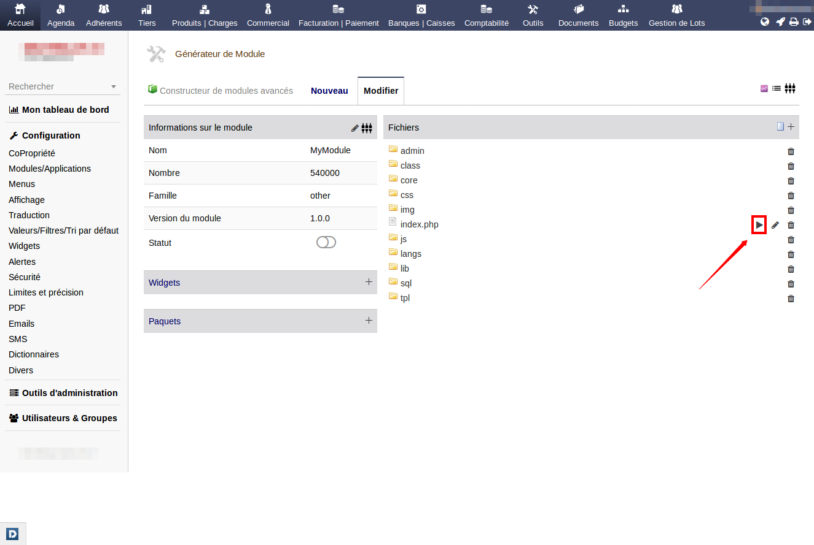

All you have to do now is to modify the source code of the page and write your own PHP code on it.

?> **Note**: damb will not do everything for you, it is just there to help you get started, so you will always need to dive into the Dolibarr ecosystem and understand how the core modules work to get a better understanding.

## Delete a module

To delete a module, first disable it, then delete the module folder from Dolibarr's **htdocs/custom** folder.

Another way to do this would be to use damb to delete it, so just click on the **Edit** tab.

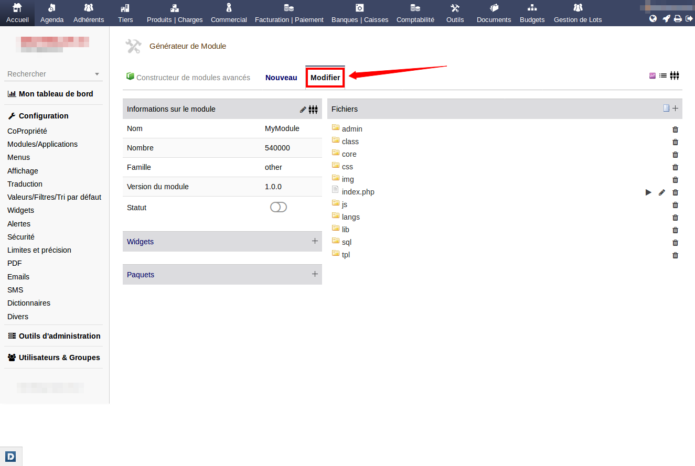

You will see a list of all available plugins in the htdocs/custom folder. Then delete the module you want by using the delete icon on the right of each module.

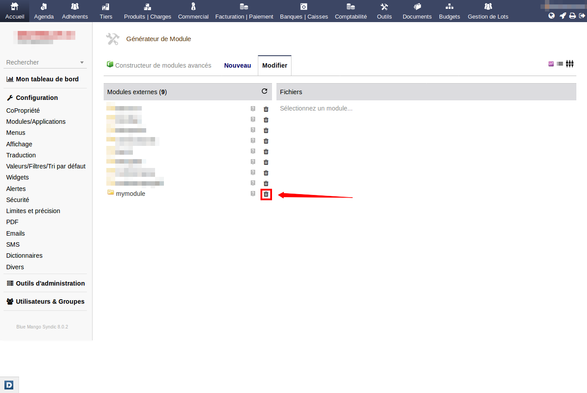

?> If you do not see a delete icon next to the module name, please enable "delete modules" option in damb's configuration page.
